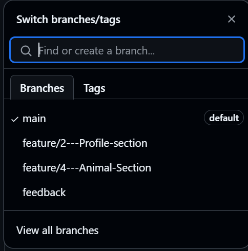

# Personal Portfolio Documentation

## 1. Student Details

- **Full Name**: Odhiambo Ryan Eric
- **Admission Number**: 151365
- **GitHub Username**: @REOsome
- **Email**: Ryan.Odhiambo@strathmore.edu

## 2. Deployed Portfolio Link

- **GitHub Pages URL**:  
 https://is-project-4th-year.github.io/build-your-portfolio-github-workflow-essentials-REOsome/

## 3. Learnings from the Git Crash Program

**What I Thought I'd Learn vs What I Actually Learned**

Write about **4 things** you expected to learn during the Git crash course (yes, we all came in with some big hopes 😅).
For each one, tell us:

What you thought it would be like `(Expectation 👀)`

What you actually learned `(Reality 😅)`

And how it helped with your personal portfolio project 💻


`Concept: GitHub Project Boards`

`Expectation 👀`: I actually didn't know this tool existed to be honest.

`Reality 😅`: It’s actually a visual to-do list and it drags my tasks from “To do” to “Done” which was nice to see.

`Impact 💡`: Helped me stay organized and track my progress on the portfolio, especially when I had lots of sections to build.

`Concept: GitHub Milestones`

`Expectation 👀`: I knew what they are I just didn't know how to use it.

`Reality 😅`: It’s actually really simple to implement and can help in building various modules efficiently.

`Impact 💡`: Helped me keep track of everything I was doing in building the portfolio.

`Concept: GitHub Issues`

`Expectation 👀`: I thought this was more of finding problems in the project to be addressed.

`Reality 😅`: It’s actually a tool to help do certain tasks in a project.

`Impact 💡`: Helped me break down the tasks to be done efficiently when doing the project.

`Concept: GitHub Feature naming`

`Expectation 👀`: I didn't know that branches and commits have to be named a certain way. I was always used to one line commit messages!

`Reality 😅`: It's actually a convinient way of knowing how different tasks have been implemented in a project.

`Impact 💡`: Helped me focus on the various tasks I was doing.

## 4. Screenshots of Key GitHub Features

Include screenshots that demonstrate how you used GitHub to manage your project. For each screenshot, write a short caption explaining what it shows.

> Upload the screenshots to your GitHub repository and reference them here using Markdown image syntax:
> (you could just simply copy and paste the image into the Assignment.md)

```markdown

```

### A. Milestones and Issues


### B. Project Board


### C. Branching



### D. Pull Requests


### E. Merge Conflict Resolution

- Screenshot of a resolved merge conflict (in a pull request, commit history, or your local terminal/GitHub Desktop).
